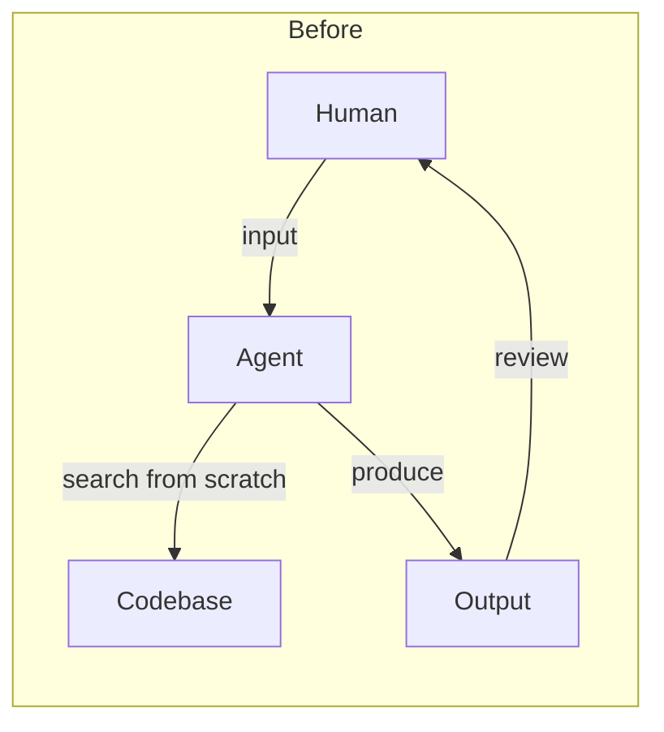
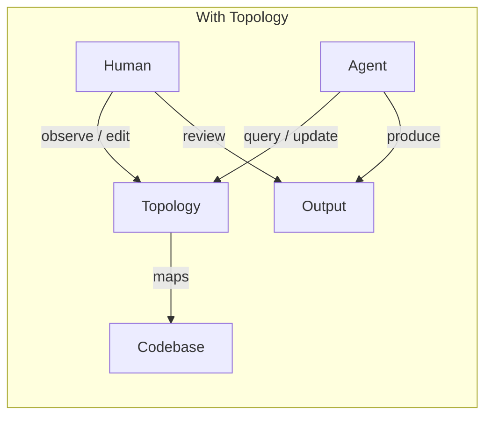

# Topology

A shared human-agent interface for task tracking. Just markdown files and your great ideas.

Topology parses markdown roadmaps into a queryable graph, giving agents a map to navigate and humans a clear view of progress.

## Background

The coding paradigm has shifted from playful vibe-coding to agent-driven development, but the interface hasn't kept up:



Each input is discrete. Agents reconstruct context every time. There's no shared memory.



Topology is the shared state — a roadmap system that both humans and agents can read and write.

## How to use

1. install the topology skills

```
npx skills add https://github.com/JerryHong08/topology
```

2. Try it
```
hi, can you use /topology skill to help me upgrade/initial my current project tasks?
```

## How it works

Think of your project as a city. ROADMAP.md is the map showing all destinations, `roadmap/*.md` are the detailed routes to each one. The `topo` skill teaches agents to read and update the map; the CLI is their navigation tool.

In the future I will introduce hooks and api endpoint which will enable human to manage the tasks, orchestrate the agents in web UI.

**For Agents:**
- `topo` CLI navigates the roadmap: find tasks, read context, update status
- One call to `topo context 1.1` returns the task goal, subtasks, and linked docs
- Convention-driven: agents follow [CONVENTION.md](.agents/skills/topology/CONVENTION.md) to draw and maintain the map

**For Humans:**
- ROADMAP.md is the single source of truth — standard markdown, readable anywhere
- `roadmap/<slug>.md` holds task discussions and design decisions
- ARCHIVE.md keeps completed work out of the way but still queryable
- In the future, there will be web ui for better ux

## File structure

For every task:
- task description
- task status(task inbox/task section)
- task id
- (optional)task doc under roadmap/task.md

```
ROADMAP.md              ← active tasks (hot)
ARCHIVE.md              ← done/dropped tasks (cold)
roadmap/
  <slug>.md             ← task detail docs and discussions
```

## CLI usage

```bash
# daily workflow
topo query -f status=todo              # find next tasks
topo query --status                    # progress summary
topo context 1.1                       # task details + linked docs
topo update 1.1 status=in-progress     # claim task
topo update 1.1 status=done            # complete task
topo archive                           # move done/dropped to ARCHIVE.md
topo scan .                            # refresh graph
```

See [SKILL.md](.agents/skills/topology/SKILL.md) for full agent instructions.

## Task lifecycle

```
idea → discuss → todo → in-progress → done → archived
                                     → dropped → archived
```

Important tasks go through a **discussion phase** before execution — captured in `roadmap/<slug>.md` with context, analysis, decision, and plan. See [CONVENTION.md](.agents/skills/topology/CONVENTION.md).

## Install

```bash
cargo install --path .
```

Requires Rust toolchain. The binary is installed to `~/.cargo/bin/topo`.

## Architecture

```
src/
├── ops/                    # Core business logic
│   ├── mod.rs              # Shared data types (AddTaskInput, UpdateTaskInput, etc.)
│   ├── add.rs              # Add task logic
│   ├── delete.rs           # Delete task logic
│   ├── update.rs           # Update task status
│   ├── archive.rs          # Archive done/dropped tasks
│   └── unarchive.rs        # Restore archived tasks
│
├── serve.rs                # HTTP API + WebSocket
├── main.rs                 # CLI entry point
├── scan/                   # Markdown parser
├── graph.rs                # Data structures
└── query.rs                # Graph traversal
```

**Call flow:**

```
         ┌─────────────┐
         │   Request   │
         └──────┬──────┘
                │
    ┌───────────┴───────────┐
    ▼                       ▼
┌───────┐              ┌─────────┐
│  CLI  │              │   API   │
│main.rs│              │serve.rs │
└───┬───┘              └────┬────┘
    │                       │
    │  println         spawn_blocking
    │                  + WebSocket
    │                       │
    └───────────┬───────────┘
                ▼
         ┌─────────────┐
         │    ops/     │  ← Core logic
         └─────────────┘
                │
                ▼
         ┌─────────────┐
         │ ROADMAP.md  │
         │ ARCHIVE.md  │
         └─────────────┘
```

Both CLI and API use the same core operations from `ops/`, ensuring consistent behavior.

## Inspired by

- [OpenAI symphony](https://github.com/openai/symphony/tree/main): spec driven development orchestration
- [spec-kit](https://github.com/github/spec-kit): sdd workflow
- [A sufficiently detailed spec is code](https://haskellforall.com/2026/03/a-sufficiently-detailed-spec-is-code): thoughtful critique on sdd
- [QMD](https://github.com/tobi/qmd): semantic search
