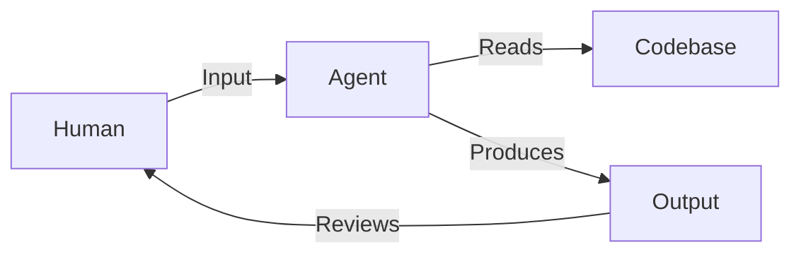

# Topology

topology is an interface for agent and human, the external and the internal.

topology decouples structure from representation, allowing humans to see and agents to reason over the same system without an external database or attribute/tag construction.

just filesystem and markdown files, and your great ideas.

## Background

The coding paradigm has rapidly shifted from playful, exploratory coding to structured, agent-driven development. Agents now handle increasingly complex tasks at an accelerating pace.

However, the Human-Machine Interface has not evolved much:



it works, but each input is discrete and agents need to find context from scratch every time.

is there a new interface that lets us adapt to this change? what is the best practice to leverage agents for coding work while maintaining better observability and a tighter feedback loop?

What if there is a map for agents, a CLI tool for agents to view the map, and a web UI for humans to directly edit the map?

that's what topology is — an interface between human and agents, a CLI tool, a skill, a development task map system.

## Core idea

For Agents:

- topology is a skill that tells agents to use `topology` CLI instead of crude `grep`/`find`, achieving higher accuracy with lower token usage.

- topology projects heterogeneous file structures into a unified graph — a multi-dimensional DAG that goes beyond what `tree` or `grep` can express.

- it's designed to surface ROADMAP.md task lists and their related context, while also working for filesystem and other markdown files. More formats will be supported in the future.

For Human:

- the initial scan builds a graph from:

  - filesystem structure
  - parsed Markdown

  this graph is the shared interface.

- for continuous update and observability, agent CLI usage will trigger an API hook via topology watchdog, reflecting the agent's view for evaluation and the updated changes for task tracking.

- all topology results can be parsed and rendered in a web UI frontend, and the frontend can directly edit files in the filesystem.

## Key features

- Zero configuration — reads your files as they are. Extracts structure from formatting that's already there. No attributes or database needed.
- Short ID aliases — every node gets a 7-char hash (`a3f2b1c`). Type short hashes or unique prefixes instead of full IDs.
- Layered resolution — IDs resolve through exact match → short hash → unique prefix, with clear errors on ambiguity.
- Graph query — filter by type, status, label; traverse children, descendants, ancestors, references, sequence.
- Multiple output formats — `--format=json|compact|ids|tree` and `--count` for agent-friendly output.
- Task context — `topology context <task>` returns goal, acceptance criteria, related files in one call.
- Diff — `topology diff` compares current scan against cached graph, showing added/removed/changed nodes and edges.
- Write-back — `topology update <ID> status=done` modifies the source markdown directly.

## Edge dimensions

Every edge type is derived from existing filesystem and markdown conventions. No proprietary syntax.

**Contains** — hierarchy from filesystem nesting and markdown heading/list structure. A directory contains files; a heading contains subheadings and tasks.

**References** — extracted from standard markdown links. `[query design](roadmap/query.md)` creates an edge from the containing node to the target file. Inline code paths like `` `src/scan/mod.rs` `` are matched against known filesystem nodes. Cross-file and within-file (`#anchor`) references are both captured. This is the edge that turns the tree into a graph.

**Sequence** — implicit ordering from markdown lists. Item 2 follows item 1. Sibling tasks under the same heading have a natural order. No syntax needed — document structure is the signal.

**Mentions** (planned) — when a markdown section names another heading, task, or file path in its body text without a formal link. Weaker than a reference, but still a signal.

## What topology reads

Topology currently operates on two sources, both using standard formats:

**Filesystem**:

- directories and files become nodes.
- Parent-child nesting becomes `Contains` edges.
- Respects `.gitignore`. No configuration needed.

**Markdown**:

- headings become section nodes.
- Task lists (`- [ ]` / `- [x]`) become task nodes with status metadata.
- Heading hierarchy becomes `Contains` edges.
- Links and inline paths become additional edge dimensions.

Future scanners can extend this to other formats (YAML, TOML, code ASTs) following the same principle: read what's there, don't require what isn't.

## CLI usage

See [REFERENCE.md](.agents/skills/topology/REFERENCE.md) for full details.

```bash
# scan
topology scan .                              # full graph (filesystem + markdown)
topology scan . --layer=markdown             # markdown layer only

# query
topology query -f type=task -f status=todo   # filter by type and metadata
topology query -f "label~scan"               # label contains keyword
topology query --roots                       # top-level entry points
topology query --descendants "ROADMAP.md#stage-1"   # prefix resolves automatically
topology query --children a3f2b1c            # use short hash
topology query --format=compact -f type=task # compact output: [short] id  label
topology query --format=tree                 # indented hierarchy view
topology query --count -f type=task          # just the count
topology query --status                      # roadmap progress summary

# context
topology context scan                        # goal, criteria, related files for a task

# update
topology update a3f2b1c status=done          # mark task done by short hash
topology update "ROADMAP.md#some-task" status=todo   # or by full/prefix ID

# diff
topology diff .                              # compare current vs cached graph
```

## Install

```bash
cargo install --path .
```

Requires Rust toolchain. The binary is installed to `~/.cargo/bin/topology`.

## Inspired by

- [OpenAI symphony](https://github.com/openai/symphony/tree/main): spec driven development(sdd) development orchestration
- [spec-kit](https://github.com/github/spec-kit): sdd workflow
- [Blog: A sufficiently detailed spec is code](https://haskellforall.com/2026/03/a-sufficiently-detailed-spec-is-code): thoughtful critic on sdd
- [QMD](https://github.com/tobi/qmd): semantic search for subsequently powering the topology cli
