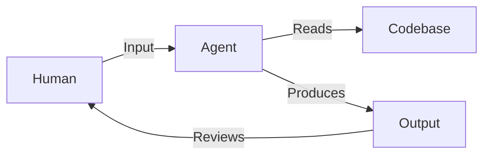

# Topology

topology is a interface for agent and human, the external and the internal.

topology decouples structure from representation, allowing humans to see and agents to reason over the same system without using external database or attribute/tag construction.

just file system and markdown files, and your great ideas.

## Background

the coding pradigm has been shifted from playful vibe coding to structured agent coding really fast, and the agent seems to be handle really decent and complex job in a fast evolving speed.

but the Human-Machine-Interface hasn't really change much:



it works but the each inputs are discrete and the agents need to find the context from scratch everytime.

is there a new interface that let us adapts to this change? what is the best practice to leverage the agents to help us do the coding work while we can have better observability and feedback adjusted loop?

What if, there is map for Agents, and a cli tool for agents to view the map, and a web ui for human to directly edit the map?

that's what topology is, an interface between human and agents, a cli tool, a skill, a development task map system.

## Core idea

For Agents:

the topology is a skill that tells agent to use `topology cli` while not use crude `grep`/`find` to archive high accuracy and token save.

topology projects heterogeneous file structures into a unified graph — a multi-dimensional DAG that goes beyond what `tree` or `grep` can express.

it's specifically designed for demonstrate the ROADMAP.md tasks list and its related context, while also works for file system and other markdown files, more format will be supported in the future.

For Human:

## Key features

* topology reads/parses your files as they are. it extracts from the file from the formatting structure that's already there. no atrributes or database system needed.

## Edge dimensions

Every edge type is derived from existing filesystem and markdown conventions. No proprietary syntax.

**Contains** — hierarchy from filesystem nesting and markdown heading/list structure. A directory contains files; a heading contains subheadings and tasks. Already implemented.

**References** — extracted from standard markdown links. `[query design](roadmap/query.md)` creates an edge from the containing node to the target file. Inline code paths like `` `src/scan/mod.rs` `` are matched against known filesystem nodes. Cross-file and within-file (`#anchor`) references are both captured. This is the edge that turns the tree into a graph.

**Sequence** — implicit ordering from markdown lists. Item 2 follows item 1. Sibling tasks under the same heading have a natural order. No syntax needed — document structure is the signal.

**Mentions** — when a markdown section names another heading, task, or file path in its body text without a formal link. Weaker than a reference, but still a signal. Detected by matching text fragments against known node labels and IDs.

## What topology reads

Topology currently operates on two sources, both using standard formats:

**Filesystem**:

* directories and files become nodes.
* Parent-child nesting becomes `Contains` edges.
* Respects `.gitignore`. No configuration needed.

**Markdown**:

* headings become section nodes.
* Task lists (`- [ ]` / `- [x]`) become task nodes with status metadata.
* Heading hierarchy becomes `Contains` edges.
* Links and inline paths become additional edge dimensions.

Future scanners can extend this to other formats (YAML, TOML, code ASTs) following the same principle: read what's there, don't require what isn't.

## Queries this enables

```bash
# What files does this task reference?
topology query --references "ROADMAP.md#query"

# What tasks mention this source file?
topology query --mentions "src/scan/mod.rs"

# What's the next unfinished task in sequence?
topology query type=task status=todo --first-in-sequence

# Root nodes — entry points with no incoming edges
topology query --roots
```

## Current CLI

```bash
topology scan .                        # full graph (filesystem + markdown)
topology scan . --layer=markdown       # markdown layer only
topology query type=task status=todo   # filter by type and metadata
topology query --roots                 # top-level entry points
topology query --descendants "ROADMAP.md#stage-1-agent-interface"
topology query "label~scan"            # label contains keyword
topology status                        # roadmap progress summary
topology context scan                  # load task context
```

### Inspired By

* [OpenAI symphony](https://github.com/openai/symphony/tree/main): spec driven development(sdd) development orchestration
* [spec-kit](https://github.com/github/spec-kit): sdd workflow
* [Blog: A sufficiently detailed spec is code](https://haskellforall.com/2026/03/a-sufficiently-detailed-spec-is-code): thoughtful critic on sdd
* [QMD](https://github.com/tobi/qmd): semantic search for subsequently powering the topology cli
